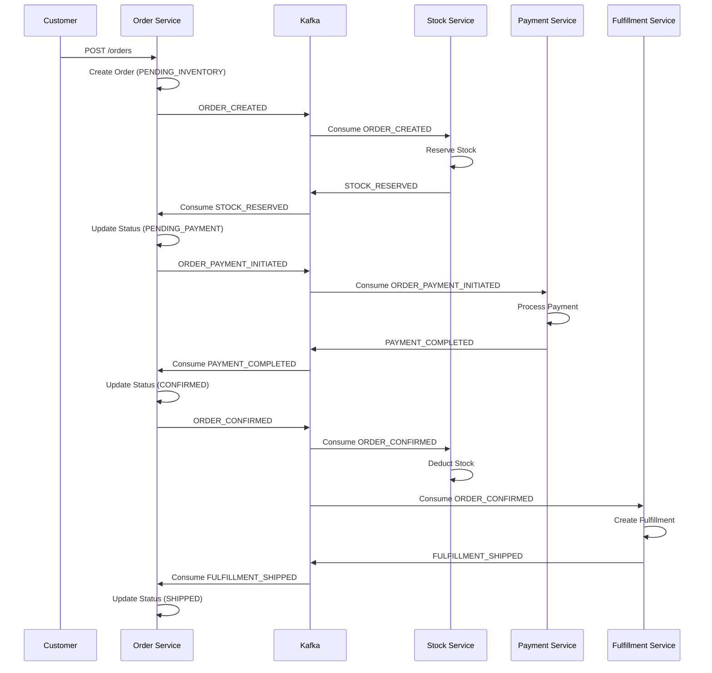
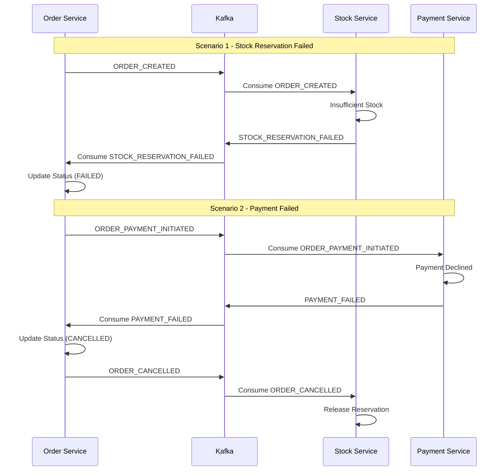
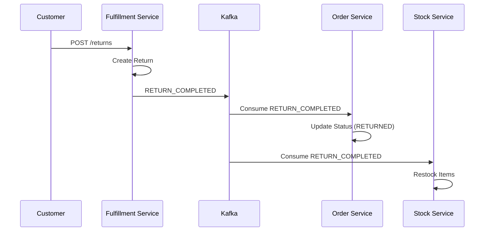
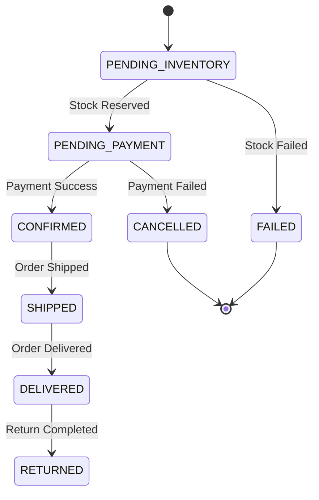

# Event-Driven Microservices Architecture

<div align="center">


**Production-grade event-driven microservices with Kafka, Outbox Pattern, and SAGA orchestration**

</div>

---

## 🎯 Key Features

- **Event-Driven Architecture**: Services communicate via Apache Kafka events
- **Outbox Pattern**: Guarantees exactly-once event publishing
- **SAGA Orchestration**: Choreography-based distributed transaction management
- **Kafka Streams**: Real-time order validation and enrichment
- **Database per Service**: Each service owns its data (PostgreSQL)
- **Async Processing**: Non-blocking parallel calls with CompletableFuture

## 🛠️ Tech Stack

| Category | Technology |
|----------|------------|
| **Language** | Java 26 |
| **Framework** | Spring Boot 3.5 |
| **Messaging** | Apache Kafka 3.7 |
| **Stream Processing** | Kafka Streams, Avro |
| **Database** | PostgreSQL 16 |
| **Migrations** | Flyway |
| **Build** | Maven (Multi-module) |
| **Testing** | JUnit 5, Mockito |

## 📦 Services

| Service | Port | Responsibility |
|---------|------|----------------|
| **common-service** | - | Shared DTOs, Events, Enums, Exceptions |
| **account-service** | 8088 | Customer management, Addresses |
| **order-service** | 8082 | Order creation, Orchestration, Status management |
| **stock-service** | 8081 | Product catalog, Inventory, Stock reservation |
| **payment-service** | 8083 | Payment processing, Refunds, Transaction audit |
| **fulfillment-service** | 8085 | Shipping, Tracking, Returns management |
| **order-enrichment-streams** | 8084 | Real-time order validation via Kafka Streams |

## 🔄 Order Flow

### From Order Creation to Fulfillment



### Compensation Flow (Failures)



### Return Flow



### Order Status Lifecycle



### SAGA Compensation

```mermaid
    flowchart TD
    A[Order Created] --> B{Stock Check}
    B -->|Available| C[Reserve Stock]
    B -->|Unavailable| D[Order Failed]
    D --> E[Compensate: Nothing to undo]
    C --> F{Payment}
    F -->|Success| G[Order Confirmed]
    F -->|Failed| H[Order Cancelled]
    H --> I[Compensate: Release Stock]
    G --> J[Deduct Stock]
    G --> K[Create Fulfillment]
    G --> L{Refund?}
    L -->|Yes| M[Refund Payment]
    M --> N[Compensate: Restock Items]
